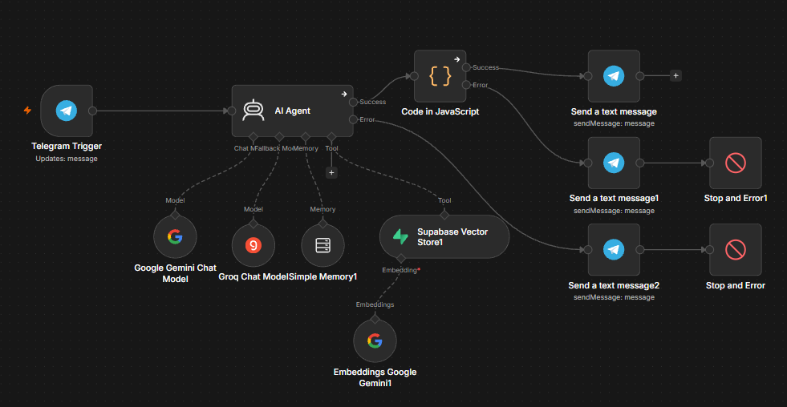
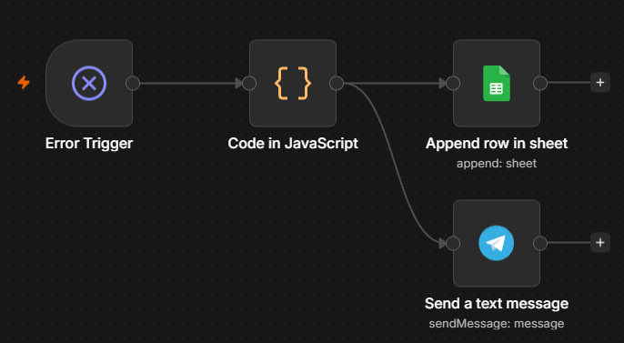
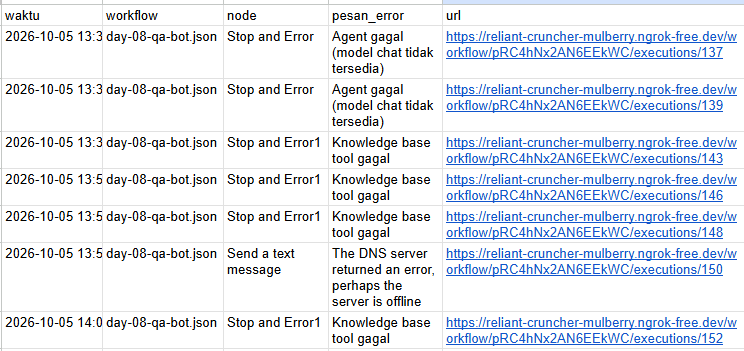
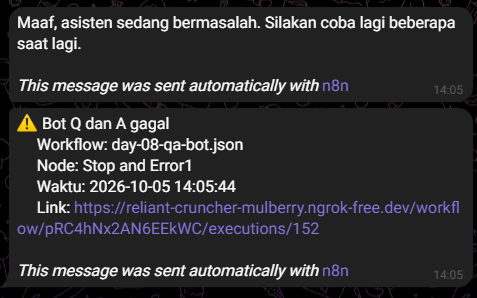
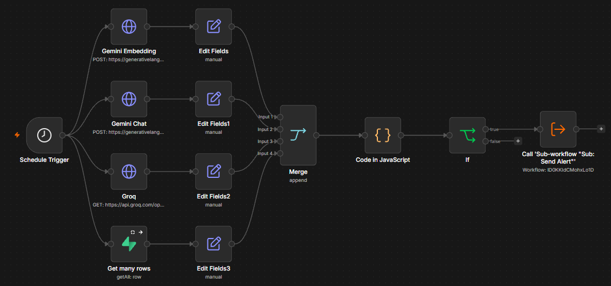
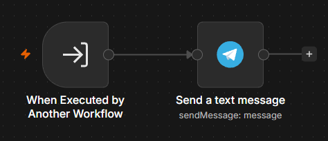
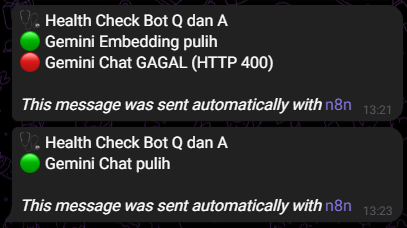

# 🚀 n8n & AI Automation Learning Journal

Daily documentation on building workflow automations with n8n and AI.

---

## 📅 Day 1: Email-to-Telegram Notification Workflow

### 🎯 Objective

Automate tracking of incoming emails by extracting essential metadata (Sender, Subject, Snippet) and delivering instant structured alerts directly to a Telegram channel.

### 🛠️ Tech Stack & Nodes Used

- **n8n Self-Hosted** (Gmail Trigger, Code Node, Telegram Node)
- **Google Workspace API** (OAuth2)
- **Telegram Bot API**

### 💡 Key Learnings Today

1. Connected Gmail trigger using OAuth2 authentication in n8n self-hosted.
2. Extracted and formatted nested JSON properties (`from`, `subject`, `snippet`) via JavaScript Code Node.
3. Configured custom Telegram Bot messaging with Markdown formatting.

### 📷 Workflow Visual & Output

<p align="center">
  
</p>

---

## 📅 Day 2: AI Email Summarizer & Urgency Classifier

### 🎯 Objective

Streamline email processing by connecting a Gmail trigger directly to an LLM via Basic LLM Chain to generate concise 2-sentence summaries and analyze urgency levels before sending alerts to Telegram.

### 🛠️ Tech Stack & Nodes Used

- **n8n Self-Hosted** (Gmail Trigger, Basic LLM Chain, Telegram Node)
- **Groq Chat Model** (LLM Integration)
- **Telegram Bot API**

### 💡 Key Learnings Today

1. Implemented a streamlined 3-node architecture for efficient single-prompt AI processing.
2. Formatted prompt templates to output structured text without over-engineering with complex Agent nodes.
3. Successfully dynamically mapped AI outputs and email metadata into Telegram notification templates.

### 📷 Workflow & Result

<p align="center">
  
</p>

<p align="center">
  
</p>

---

## 📅 Day 3: Webhook Lead Ingestion, AI Sentiment/Action Processing & Database Logging

### 🎯 Objective

Build a real-time data ingestion pipeline using Webhooks to parse inbound lead payloads, process text with LLM for sentiment classification and actionable next steps, dynamically log structured records into Google Sheets, and dispatch notifications via Telegram.

### 🛠️ Tech Stack & Nodes Used

- **n8n Self-Hosted** (Webhook Trigger, Basic LLM Chain, Google Sheets Node, Telegram Node)
- **Groq Chat Model** (LLM Integration)
- **Google Sheets API** (OAuth2 / Service Account)
- **Telegram Bot API**
- **cURL / Postman** (Testing Trigger)

### 💡 Key Learnings Today

1. Configured Webhook Triggers to handle incoming JSON POST payloads.
2. Formatted prompt instructions to return pure JSON output containing multi-field metadata (`sentimen` & `tindakan`).
3. Parsed stringified JSON responses using expression mode `JSON.parse()` for seamless mapping into database rows and chat alert templates.
4. Integrated automated row appending to maintain a structured lead database on Google Sheets.

### 📷 Workflow & Output

<p align="center">
  
</p>

<p align="center">
  
</p>

<p align="center">
  
</p>

---

## 📅 Day 4: AI-Powered Smart Lead Router & Conditional Escalation

### 🎯 Objective

Build an automated lead triage and escalation pipeline that classifies incoming message payloads by urgency and category using LLM, then dynamically routes them using conditional logic nodes (Switch) to trigger instant Telegram escalation for URGENT tickets or standard background logging for routine requests.

### 🛠️ Tech Stack & Nodes Used

- **n8n Self-Hosted** (Webhook Trigger, Basic LLM Chain, Switch Node, Google Sheets Node, Telegram Node)
- **Groq Chat Model** (LLM Classifier)
- **Google Sheets API** & **Telegram Bot API**
- **cURL / Postman**

### 💡 Key Learnings Today

1. Designed multi-branch routing workflows using n8n Switch nodes based on AI evaluation results.
2. Formatted prompt templates for zero-shot classification returning JSON structure (`urgensi`, `kategori`, `ringkasan`).
3. Mapped upstream node data explicitly across long-chain branches (`$('Basic LLM Chain').item.json.text`) to avoid undefined payload bugs.
4. Implemented priority-based alerting to prevent notification fatigue while securing critical escalation events.

### 📷 Workflow & Output

<p align="center">
  
</p>

<p align="center">
  
</p>

<p align="center">
  
</p>

---

## 📅 Day 5: Multi-Modal AI Document & Invoice Processing Pipeline

### 🎯 Objective

Build an automated document and receipt/invoice processing pipeline capable of ingesting binary image uploads via n8n Form Trigger, extracting structured financial data using an AI Agent with Multimodal Vision (Gemini 1.5 Flash), sanitizing dynamic JSON payloads, logging structured transactions into Google Sheets, and dispatching real-time formatted financial reports to Telegram.

### 🛠️ Tech Stack & Nodes Used

- **n8n Self-Hosted** (Form Trigger, AI Agent Node, Google Sheets Node, Telegram Node)
- **Google Gemini Chat Model** (`gemini-2.5-flash`)
- **Google Sheets API** & **Telegram Bot API**

### 💡 Key Learnings Today

1. Ingested binary image payloads directly from n8n Form Trigger into an AI Agent node connected with Google Gemini Chat Model.
2. Utilized Multimodal Vision capabilities to automatically process image files and extract structured financial fields (`nama_vendor`, `tanggal`, `total_belanja`, `kategori`, `ringkasan_item`).
3. Applied regex string sanitization (`.replace(/```json|```/g, '')`) on `$('AI Agent').item.json.output` to eliminate markdown formatting and prevent `undefined` parsing errors.
4. Built an end-to-end automated financial logging pipeline with real-time Telegram receipt notifications.

### 📷 Workflow & Output

<p align="center">
  
</p>

<p align="center">
  
</p>

<p align="center">
  
</p>

---

## 📅 Day 6: RAG-Powered AI Customer Support Bot with Dynamic Knowledge Base & Memory

### 🎯 Objective

Build an intelligent multi-turn Telegram customer support bot powered by an AI Agent. The bot leverages Google Gemini for LLM reasoning, Window Buffer Memory for conversational context retention across messages, and a Google Sheets Tool / Vector Store as a dynamic Knowledge Base (RAG) to process customer queries with precise, grounded responses.

### 🛠️ Tech Stack & Nodes Used

- **n8n Self-Hosted** (Telegram Trigger, AI Agent Node, Google Sheets Tool, Simple Memory, Telegram Node)
- **Google Gemini Chat Model** (`gemini-2.5-flash`)
- **Google Sheets API** (Knowledge Base / RAG Search)
- **Telegram Bot API** & **ngrok Tunneling**

### 💡 Key Learnings Today

1. **Agentic Workflow**: Understood the architectural differences between a standard LLM Chain and an AI Agent capable of autonomous tool execution and decision-making.
2. **Conversational Memory**: Implemented Window Buffer Memory to maintain multi-turn chat context across ongoing Telegram interactions.
3. **Grounding & RAG (Retrieval-Augmented Generation)**: Prevented AI hallucinations by constraining response generation strictly to verified official FAQ documents stored in the Google Sheets Knowledge Base.
4. **System Prompt & Intent Routing**: Refined system prompt rules to classify user intent—separating conversational greetings from domain-specific inquiries requiring Knowledge Base retrieval.
5. **Infrastructure Recovery**: Restored a corrupted n8n database instance, migrated workflow data and encrypted credentials using `N8N_ENCRYPTION_KEY`, and re-established active webhooks via ngrok.

### 📷 Workflow & Output

<p align="center">
  
</p>

<p align="center">
  
</p>

<p align="center">
  
</p>

---

## 📅 Day 7: AI Executive Assistant – Multi-Tool Calendar & Task Orchestrator

### 🎯 Objective

Build an autonomous AI Executive Assistant using n8n Agentic Architecture. The workflow accepts natural language instructions via n8n Form, leverages Google Gemini (`gemini-2.5-flash`) as the core reasoning engine with dynamic system prompt time-offset calculations, and dynamically executes multi-tool actions across Google Calendar and Google Tasks before dispatching an execution summary to Telegram.

### 🛠️ Tech Stack & Nodes Used

- **n8n Self-Hosted** (Form Trigger, AI Agent Node, Google Calendar Tool, Google Tasks Tool, Telegram Node)
- **Google Gemini Chat Model** (`gemini-2.5-flash`)
- **Google Calendar API** & **Google Tasks API**
- **Telegram Bot API**

### 💡 Key Learnings Today

1. **Multi-Tool Agentic Orchestration**: Built an autonomous AI Agent capable of dynamically selecting and executing multiple tools (Google Calendar and Google Tasks) in a single execution pipeline based on natural language intent.
2. **Dynamic Time-Offset Calculations**: Configured Luxon time expressions (`$now.setZone().plus()`) in the system prompt to allow the LLM to calculate relative time references (e.g., "besok", "lusa") accurately in real-time.
3. **Stateless Efficiency**: Optimized workflow architecture by eliminating redundant Memory nodes for stateless single-shot form triggers, reducing execution latency and unnecessary processing overhead.
4. **Tool Argument Alignment**: Configured tool parameters (`summary`, `start`, `end`, `title`) to be dynamically populated by the AI model (`Defined by Model`) using strict ISO 8601 timestamps and clean titles.

### 📷 Workflow & Output

<p align="center">
  
</p>

<p align="center">
  
  
  
</p>

---

## 📅 Day 8: RAG Document Assistant – PDF Ingestion Pipeline with Supabase Vector Store

### 🎯 Objective

Solve a real problem: the official thesis-writing guideline (a 117-page PDF) is hard to search, and students keep flipping through it to find simple formatting rules. This day builds a two-workflow RAG system: one pipeline that ingests the PDF into a vector database, and a Telegram bot that answers questions strictly from the document and cites the page number. Unlike Day 6 (a hand-written FAQ in Google Sheets), the knowledge base here is built automatically from a long document using chunking and embeddings.

### 🛠️ Tech Stack & Nodes Used

- **n8n Self-Hosted** (Form Trigger, Extract From File, Code Node, Loop Over Items, Wait, Supabase Vector Store, Default Data Loader, Recursive Character Text Splitter, Telegram Trigger, AI Agent Node, Telegram Node)
- **Google Gemini** (Embeddings, 3072 dimensions) and Gemini Chat Model for the agent
- **Supabase** (PostgreSQL + `pgvector`) as the vector database
- **Telegram Bot API**

### 🏗️ Architecture

```
Workflow A – Ingestion
Form (upload PDF) → Extract From PDF → Code (split per page, drop empty pages)
  → Loop Over Items (batch size 1) → Supabase Vector Store (Insert)
        ├─ Default Data Loader → Recursive Character Text Splitter (600 / overlap 100)
        └─ Embeddings Google Gemini
  → Wait (2s) → back to loop … → Telegram (done notification)

Workflow B – Q&A
Telegram Trigger → AI Agent ⇄ Supabase Vector Store (retrieve as tool) → Telegram reply with page citation
```

Result: 113 text pages ingested into roughly 360 chunks, each stored with `sumber`, `halaman` (PDF page index) and `halaman_cetak` (printed page number) metadata.

### 💡 Key Learnings Today

1. **Vector store fundamentals**: Chunking (600 characters, 100 overlap), embeddings, and similarity search with `pgvector`, including creating the table and `match_documents` function in Supabase.
2. **Retrieval as an agent tool**: The agent only calls the knowledge base when the tool description and system prompt tell it to, and it must answer strictly from retrieved context and refuse when nothing relevant is found.
3. **Metadata for citations**: Each chunk carries its source page so every answer can cite where it came from, which makes hallucinations easy to spot.
4. **Rate-limit-aware ingestion**: Processing page by page with Loop Over Items (batch size 1), a Wait node, and retry-on-fail instead of embedding hundreds of chunks in one burst.
5. **Embedding consistency**: Documents and queries must use the same embedding model; mixing models produces dimension mismatches (3072 vs 1024) and meaningless similarity scores.

### 🧩 Challenges & Solutions

| Problem                                                                                                      | Cause / Finding                                                                                                                          | Solution                                                                                                           |
| ------------------------------------------------------------------------------------------------------------ | ---------------------------------------------------------------------------------------------------------------------------------------- | ------------------------------------------------------------------------------------------------------------------ |
| `vector must have at least 1 dimension` when ingesting the full PDF, while a 5-page PDF worked               | Embedding calls returned empty vectors once the number of chunks grew (5 pages OK, 45 pages failed); suspected request size / rate limit | Split the PDF into one item per page, loop with batch size 1, add a Wait node and retry-on-fail                    |
| Default Data Loader failed with "expects binary file" after switching to page-by-page processing             | The loader was still configured for binary PDF input                                                                                     | Changed Type of Data to JSON and mode to Load Specific Data with the page text expression                          |
| Telegram node flooded the chat with dozens of messages                                                       | The `done` output of the loop carries every processed item (about 360), and Telegram sends one message per item                          | Enabled **Execute Once** on the Telegram node and used a summary message instead of per-item data                  |
| Agent answered without searching the knowledge base                                                          | Weak tool description and permissive system prompt                                                                                       | Rewrote the tool name/description and made the system prompt require tool use for every guideline question         |
| Cited page (43) did not match the printed page (34)                                                          | The PDF index counts the cover and roman-numbered pages, while the document uses printed numbers                                         | Stored both `halaman` and `halaman_cetak` (offset = 9) and made the agent cite the printed page                    |
| Switching to a different embedding model for queries failed with `different vector dimensions 3072 and 1024` | Query embeddings and stored document embeddings came from different models                                                               | Rule adopted: one embedding model for both ingestion and retrieval; switching models means re-ingesting everything |

### ✅ Initial Validation

Asked "what are the margin sizes?" via Telegram. The bot returned 4 cm (top, left) and 3 cm (bottom, right) for Latin script, and cited printed page 34, which matches the original PDF. A full evaluation (15 questions plus 3 out-of-scope questions) will be added in a follow-up update.".

### 🔮 Next Improvement

The Gemini free-tier quota ran out during testing and the bot stopped working. Day 9 will focus on error handling, alerting, and a fallback model so a single quota limit does not take the assistant down.

### 📷 Workflow & Output


---

## 📅 Day 8: RAG Document Assistant – PDF Ingestion Pipeline with Supabase Vector Store

### 🎯 Objective

Solve a real problem: the official thesis-writing guideline (a 117-page PDF) is hard to search, and students keep flipping through it to find simple formatting rules. This day builds a two-workflow RAG system: one pipeline that ingests the PDF into a vector database, and a Telegram bot that answers questions strictly from the document and cites the page number. Unlike Day 6 (a hand-written FAQ in Google Sheets), the knowledge base here is built automatically from a long document using chunking and embeddings.

### 🛠️ Tech Stack & Nodes Used

- **n8n Self-Hosted** (Form Trigger, Extract From File, Code Node, Loop Over Items, Wait, Supabase Vector Store, Default Data Loader, Recursive Character Text Splitter, Telegram Trigger, AI Agent Node, Telegram Node)
- **Google Gemini** (Embeddings, 3072 dimensions) and Gemini Chat Model for the agent
- **Supabase** (PostgreSQL + `pgvector`) as the vector database
- **Telegram Bot API**

### 🏗️ Architecture

```
Workflow A – Ingestion
Form (upload PDF) → Extract From PDF → Code (split per page, drop empty pages)
  → Loop Over Items (batch size 1) → Supabase Vector Store (Insert)
        ├─ Default Data Loader → Recursive Character Text Splitter (600 / overlap 100)
        └─ Embeddings Google Gemini
  → Wait (2s) → back to loop … → Telegram (done notification)

Workflow B – Q&A
Telegram Trigger → AI Agent ⇄ Supabase Vector Store (retrieve as tool) → Telegram reply with page citation
```

Result: 113 text pages ingested into roughly 360 chunks, each stored with `sumber`, `halaman` (PDF page index) and `halaman_cetak` (printed page number) metadata.

### 💡 Key Learnings Today

1. **Vector store fundamentals**: Chunking (600 characters, 100 overlap), embeddings, and similarity search with `pgvector`, including creating the table and `match_documents` function in Supabase.
2. **Retrieval as an agent tool**: The agent only calls the knowledge base when the tool description and system prompt tell it to, and it must answer strictly from retrieved context and refuse when nothing relevant is found.
3. **Metadata for citations**: Each chunk carries its source page so every answer can cite where it came from, which makes hallucinations easy to spot.
4. **Rate-limit-aware ingestion**: Processing page by page with Loop Over Items (batch size 1), a Wait node, and retry-on-fail instead of embedding hundreds of chunks in one burst.
5. **Embedding consistency**: Documents and queries must use the same embedding model; mixing models produces dimension mismatches (3072 vs 1024) and meaningless similarity scores.

### 🧩 Challenges & Solutions

| Problem                                                                                                      | Cause / Finding                                                                                                                          | Solution                                                                                                           |
| ------------------------------------------------------------------------------------------------------------ | ---------------------------------------------------------------------------------------------------------------------------------------- | ------------------------------------------------------------------------------------------------------------------ |
| `vector must have at least 1 dimension` when ingesting the full PDF, while a 5-page PDF worked               | Embedding calls returned empty vectors once the number of chunks grew (5 pages OK, 45 pages failed); suspected request size / rate limit | Split the PDF into one item per page, loop with batch size 1, add a Wait node and retry-on-fail                    |
| Default Data Loader failed with "expects binary file" after switching to page-by-page processing             | The loader was still configured for binary PDF input                                                                                     | Changed Type of Data to JSON and mode to Load Specific Data with the page text expression                          |
| Telegram node flooded the chat with dozens of messages                                                       | The `done` output of the loop carries every processed item (about 360), and Telegram sends one message per item                          | Enabled **Execute Once** on the Telegram node and used a summary message instead of per-item data                  |
| Agent answered without searching the knowledge base                                                          | Weak tool description and permissive system prompt                                                                                       | Rewrote the tool name/description and made the system prompt require tool use for every guideline question         |
| Cited page (43) did not match the printed page (34)                                                          | The PDF index counts the cover and roman-numbered pages, while the document uses printed numbers                                         | Stored both `halaman` and `halaman_cetak` (offset = 9) and made the agent cite the printed page                    |
| Switching to a different embedding model for queries failed with `different vector dimensions 3072 and 1024` | Query embeddings and stored document embeddings came from different models                                                               | Rule adopted: one embedding model for both ingestion and retrieval; switching models means re-ingesting everything |

### ✅ Initial Validation

Asked "what are the margin sizes?" via Telegram. The bot returned 4 cm (top, left) and 3 cm (bottom, right) for Latin script, and cited printed page 34, which matches the original PDF. A full evaluation (15 questions including paraphrased ones, plus 3 out-of-scope questions to test refusal) is documented separately in `docs/day-08-evaluation.md`.

### 🔮 Next Improvement

The Gemini free-tier quota ran out during testing and the bot stopped working. Day 9 will focus on error handling, alerting, and a fallback model so a single quota limit does not take the assistant down.

### 📷 Workflow & Output


---

## 📅 Day 9: Production Hardening – Error Alerting, Logging & Model Fallback

### 🎯 Objective

Make the Day 8 RAG assistant resilient and observable. During Day 8 the Gemini free-tier quota ran out and the bot silently stopped working with nobody notified. This day adds a global error workflow that alerts and logs failures, a fallback LLM so a single provider limit does not take the bot down, and explicit verification of knowledge-base tool results.

### 🛠️ Tech Stack & Nodes Used

- **n8n Self-Hosted** (Error Trigger, Code Node, Google Sheets Node, Telegram Node, Stop and Error, AI Agent with Fallback Model, Retry On Fail)
- **Google Gemini Chat Model** (primary) and **Groq Chat Model** (fallback)
- **Supabase Vector Store** (retrieval tool) with **Google Gemini Embeddings**
- **Google Sheets API** (error log) and **Telegram Bot API**

### 🏗️ Architecture

```
Global Error Handler
Error Trigger → Code (format: time, workflow, node, error, execution link)
  → Google Sheets (append to "Error Log") → Telegram (alert to owner)

Q&A Bot (Day 8 workflow, hardened)
Telegram Trigger → AI Agent (Gemini → fallback Groq)  ⇄ Supabase Vector Store tool
  ├─ Success → Code (verify tool result via intermediate steps)
  │      ├─ OK    → Telegram reply with answer
  │      └─ Error → Telegram (friendly message) → Stop and Error
  └─ Error → Telegram (friendly message) → Stop and Error
Stop and Error marks the execution as failed → triggers the Global Error Handler
```

### 💡 Key Learnings Today

1. **Error Workflows**: A dedicated workflow with an Error Trigger receives the failed workflow's name, last executed node, error message and execution URL. It only fires for production (active) executions, not manual test runs.
2. **Fallback models**: The AI Agent can switch to a second LLM automatically when the primary fails (verified by breaking the Gemini key and still receiving answers via Groq).
3. **Verifying tool results**: Enabling intermediate steps and inspecting the tool output lets the workflow detect a failed knowledge-base lookup instead of trusting the agent's final text.
4. **Handled errors are not errors**: If a failure is routed to an error branch that succeeds, n8n records the execution as successful and the global error workflow never fires. A Stop and Error node at the end of the branch makes the execution fail on purpose, so the user gets a friendly message and the owner still gets the alert and a log entry.

### 🧩 Challenges & Solutions

| Problem                                                            | Cause / Finding                                                                                                    | Solution                                                                                                                |
| ------------------------------------------------------------------ | ------------------------------------------------------------------------------------------------------------------ | ----------------------------------------------------------------------------------------------------------------------- |
| Error alerts never reached the global error handler                | Errors were routed to an error branch that sent a Telegram message successfully, so the execution ended as Success | Added a Stop and Error node after the user-facing message to mark the execution as failed                               |
| Telegram showed the literal text `{{ $json.error }}`               | The Text field was in Fixed mode instead of Expression mode                                                        | Switched the field to Expression and replaced raw error text with a short alert plus the execution ID                   |
| Agent branch with On Error set to continue had no handler attached | Unconnected error output ends the execution silently                                                               | Connected the Agent error output to the same notification and Stop and Error path                                       |
| Raw API errors were being sent to the end user                     | A single Telegram node served both the user and the owner                                                          | Split into a friendly user message and a separate owner alert; detailed errors stay in the Executions tab and the Sheet |

### ✅ Failure Tests

| Scenario | Injected failure                  | Result                                                                                          |
| -------- | --------------------------------- | ----------------------------------------------------------------------------------------------- |
| 1        | Invalid Gemini chat API key       | Answer still delivered via Groq fallback                                                        |
| 2        | Invalid embedding API key         | User gets a friendly message, owner gets an alert, execution marked failed, row logged in Sheet |
| 3        | Both chat models invalid          | Same as above via the Agent error path                                                          |
| 4        | Normal operation (all keys valid) | Answer with cited page, no alert                                                                |

### 🔮 Next Improvement

Add a scheduled health check that probes the embedding and chat APIs and reports quota problems before a user hits them, and move shared logic into reusable sub-workflows.

### 📷 Workflow & Output

<p align="center">
  
</p>

<p align="center">
  
</p>

<p align="center">
  
  
</p>

---

## 📅 Day 10: Proactive Health Monitoring – Scheduled Probes, Stateful Alerting & Reusable Sub-workflow

### 🎯 Objective

Move from reacting to failures to detecting them before users are affected. In Day 8 the Gemini free-tier quota ran out and nobody knew until the bot stopped answering, and Day 9 only alerted after a user request had already failed. This day adds a scheduled health check that probes every external dependency of the RAG assistant (Gemini embeddings, Gemini chat, Groq fallback, Supabase), sends an alert only when a status actually changes, and centralizes notifications in a reusable sub-workflow shared with the global error handler.

### 🛠️ Tech Stack & Nodes Used

- **n8n Self-Hosted** (Schedule Trigger, HTTP Request, Supabase Node, Edit Fields, Merge, Code Node with workflow static data, If, Execute Workflow, Execute Workflow Trigger, Telegram Node)
- **Google Gemini API** (embedding and chat probes) and **Groq API**
- **Supabase** (database probe)
- **Telegram Bot API**

### 🏗️ Architecture

```
Health Check (every N minutes)
Schedule Trigger ─┬→ Gemini Embedding (HTTP) → Edit Fields (probe name) ─┐
                  ├→ Gemini Chat (HTTP)      → Edit Fields (probe name) ─┤
                  ├→ Groq (HTTP)             → Edit Fields (probe name) ─┼→ Merge → Code → If (alert?) → Execute Workflow
                  └→ Supabase (Get Many)     → Edit Fields (probe name) ─┘                                   │
                                                                                                             ▼
Sub: Send Alert (Execute Workflow Trigger: judul, pesan) → Telegram  ◄── also called by the Global Error Handler
```

The Code node compares each probe's result with the status saved from the previous run (`$getWorkflowStaticData`) and only produces an alert when a probe has failed several times in a row, or has recovered after being reported as failed.

### 💡 Key Learnings Today

1. **Probes**: A probe is a small, cheap request to one dependency that answers only "healthy or not". Running them on a schedule exposes quota, key and availability problems before a user hits them.
2. **Failures as data**: With the HTTP Request option Never Error, a failing API returns its status code and error body as normal data instead of stopping the workflow, so one broken probe cannot hide the others.
3. **Stateful alerting**: Workflow static data stores the previous status of each probe between executions, so the alert fires on a change (OK to failed, failed to recovered) rather than on every run. Static data only persists in production (active) executions.
4. **Debouncing**: Requiring consecutive failures before alerting filters out transient provider hiccups (a real HTTP 503 from Google appeared during testing) and avoids alert fatigue.
5. **Sub-workflows**: An Execute Workflow Trigger with defined inputs turns notification logic into a reusable building block called from both the health check and the global error handler.

### 🧩 Challenges & Solutions

| Problem                                                                             | Cause / Finding                                                                           | Solution                                                                                                   |
| ----------------------------------------------------------------------------------- | ----------------------------------------------------------------------------------------- | ---------------------------------------------------------------------------------------------------------- |
| Probe results disappeared and every probe looked healthy                            | The Edit Fields nodes only set the probe name and dropped the original response           | Enabled Include Other Input Fields and gave each probe a unique name                                       |
| Gemini probe returned `403 PERMISSION_DENIED`                                       | The HTTP Request nodes had no authentication                                              | Attached the predefined Google Gemini credential (and the Groq credential) instead of putting keys in URLs |
| Risk of an alert on every run while a dependency stays down                         | A stateless check cannot tell "still broken" from "newly broken"                          | Stored per-probe state in workflow static data and alert only on changes                                   |
| A transient `503` on the chat probe produced a failure/recovery pair within minutes | Provider hiccups are indistinguishable from real outages on a single check                | Required 2 consecutive failures before alerting; recovery is only sent if a failure alert was sent         |
| Alert text showed literal "judul:" and "pesan:" labels on one line                  | The Telegram text expression in the sub-workflow contained field labels and no line break | Rewrote the expression as two lines with no labels                                                         |
| Execution history would grow quickly                                                | The raw embedding vector (3072 numbers) was carried through every run                     | Kept only the fields the Code node needs (`probe`, `statusCode`, `error`)                                  |

### ✅ Failure Tests

| Scenario | Injected failure                                           | Result                                                                  |
| -------- | ---------------------------------------------------------- | ----------------------------------------------------------------------- |
| 1        | Invalid API key on the embedding probe                     | One failure alert (`HTTP 400`), no repeats while the key stayed invalid |
| 2        | Key restored                                               | One recovery notification                                               |
| 3        | Real transient `HTTP 503` on the chat probe during testing | Detected by the probe, which led to the consecutive-failure threshold   |

### 🔮 Next Improvement

Log every status change to a Google Sheet for uptime history, add a periodic reminder while a dependency is still down, and expose a simple status summary through a Telegram command.

### 📷 Workflow & Output

<p align="center">
  
</p>

<p align="center">
  
</p>

<p align="center">
  
</p>

---
